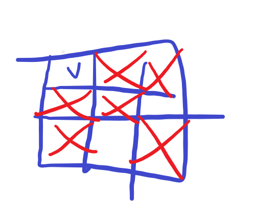

# 프로그래머스-N-Queen #

## 문제 ##

- [코드](N-Queen.cpp)
- [최적화된 코드](../20230304/N-Queen(optimized).cpp)
- 프로그래머스, Lv2, [코딩테스트 연습 - N-Queen | 프로그래머스 스쿨 (programmers.co.kr)](https://school.programmers.co.kr/learn/courses/30/lessons/12952)
- 풀이 날짜: 2023.03.02. (최적화된 풀이: 2023.03.04.)
- 시간: 20:40~21:12(32분 소요)

해당 문제는 백트래킹으로 풀 수 있다.

만약 n=12라면, dfs 방식으로 브루트포스를 돌릴 때 조건문을 달지 않는다면 경우의 수가 12^12가 되어 약 8.9조 개의 경우를 검사해야 한다. 즉, 실행 불가능하다.

그런데 이 문제의 규칙으로, 퀸은 각 행, 각 열 별로 하나의 퀸만을 배치할 수 있다.

이 점을 이용하여, 1번 열부터 열을 하나씩 증가시켜가면서 퀸을 하나씩 배치해나갈 수 있다.

그러면 퀸을 배치할 수 없는 칸이 반드시 나오게 되어 있다.

이 경우에는 아예 해당 경우에서 파생되는 모든 경우의 수를 제외한다. 즉, 더이상 검사를 진행하지 않는다.



예를 들어, X로 되어 있는 칸은 퀸을 배치했을 때 서로 공격 가능한 위치를 말한다.

그렇다면 위 예시에서 1행 1열에 퀸을 배치했다면, 2열에 퀸을 배치하는 경우에는 1행과 2행은 아예 배치할 수 없으므로 검사도 하지 않는다.

이렇게 하면 경우의 수를 크게 줄일 수 있고 N 또한 큰 수가 아니므로 프로그램이 충분히 실행가능해진다.

### 문제점 ##

그런데 실제로 해보니… n=12를 입력하니 거의 6~7초쯤 걸린다. 문제를 통과하긴 했지만, 알고리즘을 더 개선할 방법은 없을까?

### 다른 사람의 해법 ##

[우물 안 개구리.. | 프로그래머스 스쿨 (programmers.co.kr)](https://school.programmers.co.kr/questions/24716)

> 사실 조금만 더 생각하면, 한 줄에 퀸이 하나밖에 못들어간다는 걸 알텐데요..
> 
> 
> 사실 1차원 배열로 접근하는 것이 몇 배는 더 효율적이고, 코딩면에서도 간단합니다.
> 
> 만약 2차원 배열로 노가다탐색을 하면, 중복값 제거도 신경써야하고, Q에 간섭되는 범위를
> 
> 일일히 탐색해야합니다.
> 
> 하지만, 우리는 퀸이 한 줄에 하나씩 밖에 못 들어간다는 사실을 알고 있습니다.
> 
> 사실 한 행이나 한 열에는 퀸이 하나씩 밖에 못들어갑니다.
> 
> 그런 이유로 1차원을 배열사용하여 연산을 쉽게 할 수 있습니다.
> 

~~이 글을 보고 있으니 다음 아이디어가 하나 떠올랐다.~~

~~하나의 1차원 배열에 행별 퀸의 수와 열별 퀸의 수를 합산해서 저장한다면 더 빠르게 검사할 수 있지 않을까?~~

~~다음 번에 해당 방법을 통해 한 번 더 풀어보자.~~

위 글에서는 이전 퀸의 위치와 이후 퀸의 위치만 주어진다면, 퀸이 서로 공격할 수 있는 위치인지 아닌지 알 수 있다고 설명한다.

행별, 열별 퀸의 수를 합산 저장한다면 각 행마다, 각 열마다 퀸이 단 하나씩만 배치되도록 할 수는 있지만, 해당 대각선에 퀸이 존재하는지는 검출할 수는 없다.

각 행마다 반드시 하나의 퀸만이 존재할 수 있고, 이는 각 열에 대해서도 마찬가지이다.

따라서 1차원 배열에 인덱스가 행 번호를 가리키고 각 원소가 열 번호를 가리키도록 하면 각 퀸의 위치를 순차적으로 저장할 수 있다(퀸의 수는 최대 n개이므로 길이 n의 배열을 선언하면 된다).

이때, 같은 대각선에 퀸이 있는지 아닌지는 x의 차이가 y의 차이와 같을 경우, 즉 행과 열의 차이가 같다는 조건으로 판별할 수 있다.

```cpp
#include <string>
#include <vector>
#include <cmath>
#include <iostream>

using namespace std;

// 0~(n-1) 행 및 열로 구성된 체스판 위에서 row 행에서 조건에 맞는 곳에 퀸을 배치한다.
// pos의 인덱스는 행이 되고, pos[r]은 해당 행에 배치된 퀸의 열을 가리킨다.
int GetNQueen(vector<int>& pos, int row, int n)
{
    if (row == n)
        return 1;
    
    int result = 0;
    vector<bool> available(n, true); // 해당 행 row에서 배치 가능한 열을 표시한다.
    
    // 배치 불가능한 위치를 배제한다.
    for (int r = 0; r < pos.size(); r++)
    {
        available[pos[r]] = false;
        int deltaY = row - r;
        if (pos[r] - deltaY >= 0) // 이미 배치된 퀸의 왼쪽 아래 대각선에 있는 자리를 제외
            available[pos[r] - deltaY] = false;
        if (pos[r] + deltaY < n) // 이미 배치된 퀸의 오른쪽 아래 대각선에 있는 자리를 제외
            available[pos[r] + deltaY] = false;
    }
    
    for (int col = 0; col < n; col++)
        if (available[col])
        {
            pos.push_back(col);
            result += GetNQueen(pos, row + 1, n);
            pos.pop_back();
        }
    
    return result;
}

int solution(int n) {
    vector<int> pos;
    return GetNQueen(pos, 0, n);
}
```

수정된 코드는 위와 같다. n=12에 대해 기존 코드의 실행 시간이 11초 가량이었는데, 위 코드는 1초 내로 실행된다.
