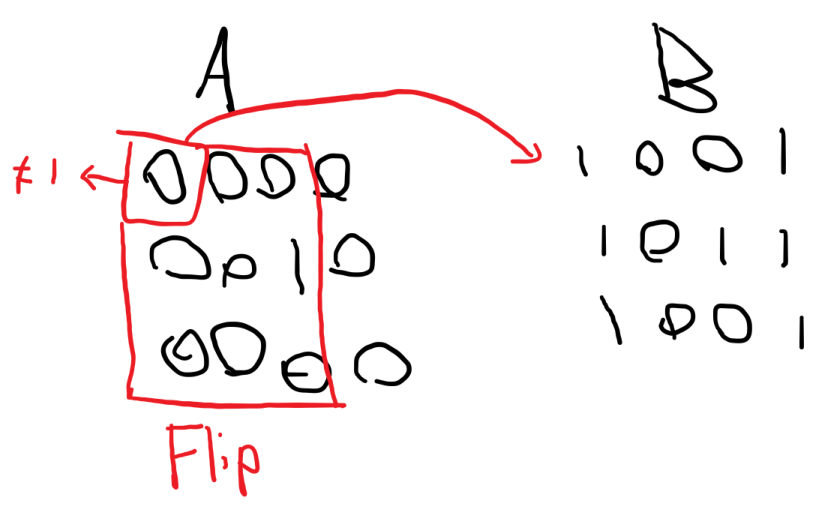

# 백준-1080 행렬

## 문제

- [코드](1080.cpp)
- 백준, 실버1, [1080번: 행렬 (acmicpc.net)](https://www.acmicpc.net/problem/1080)
- 풀이 날짜: 2023.09.19
- 풀이 시간: 며칠 걸린 거 같은데 집에 오니까 30분만에 품
- 알고리즘 분류: 그리디 알고리즘

### 문제 해설

3x3 뒤집기 연산을 사용하여 행렬을 변환할 수 있다.  

A 행렬을 B 행렬로 바꿀 수 있는가? 바꿀 수 있다면 뒤집기 연산을 몇 번 실행해야 하는가?

해당 문제에서는 A 행렬을 B 행렬로 바꿀 수 있다면 수행해야 하는 뒤집기 연산의 최솟값을 출력하고, 만약 불가능하다면 -1을 출력하도록 요구한다.

이때, 예제 3을 보면 3x3 행렬보다 작을 경우에는 뒤집기 연산을 수행할 수 없음을 알 수 있다.

```cpp
// 예제 3
1 1
1
0
```

예를 들어 아래 그림과 같이, (0, 0)번 위치에 있는 원소를 확인하고 있을 때 A와 B의 원소가 다르다면 그 원소를 기점으로 오른쪽 아래의 3x3 행렬 부분을 모두 뒤집도록 한다. 



이렇게 가능한 모든 부분을 다 탐색하고 뒤집었을 때, A와 B가 같지 않다면 A를 B로 바꿀 수 없는 것이다. 이렇게 순서대로 찾아서 뒤집어도 되는 이유는, (1) 뒤집는 연산은 두 번 실행하면 다시 원래 상태로 돌아오며 (2) 어떤 순서로 실행해도 뒤집기 연산은 결과가 동일하게 나타난다.

게다가 시간을 보았을 때, 모든 원소를 탐색하는 데에 걸리는 시간은 O(N * M)으로 50 * 50회 정도에 불과하며, 모든 원소를 다 뒤집는다고 쳐도 N * M * (3 * 3) = 50 * 50 * 9 = 2250회 가량으로 계산 횟수도 합리적이다.

### 개선할 점

내가 구현한 코드에서는 n≤3이면서 m≤3일 때는 별도의 처리를 해서, A를 B로 만들 수 있는지 따로 확인을 했다.

그러나 for문에서 r < n - 2, c < m - 2일 때에만 확인이 가능하므로 n과 m이 3보다 작거나 같아서(그런데 3*3 행렬은 아니라서) 뒤집을 수 없는 상황이 되면 아예 for문에서 뒤집을 수 있는지 체크도 하지 않는다. 그래서 굳이 넣지 않아도 되는 코드를 넣은 상황이 되어서 조금 아쉽다.