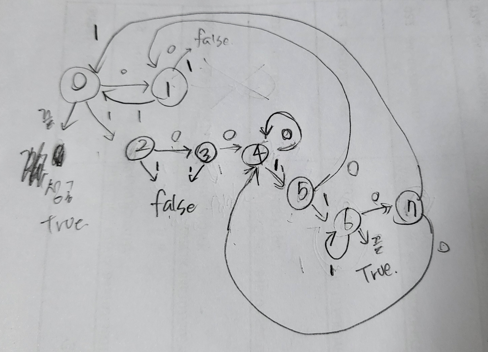
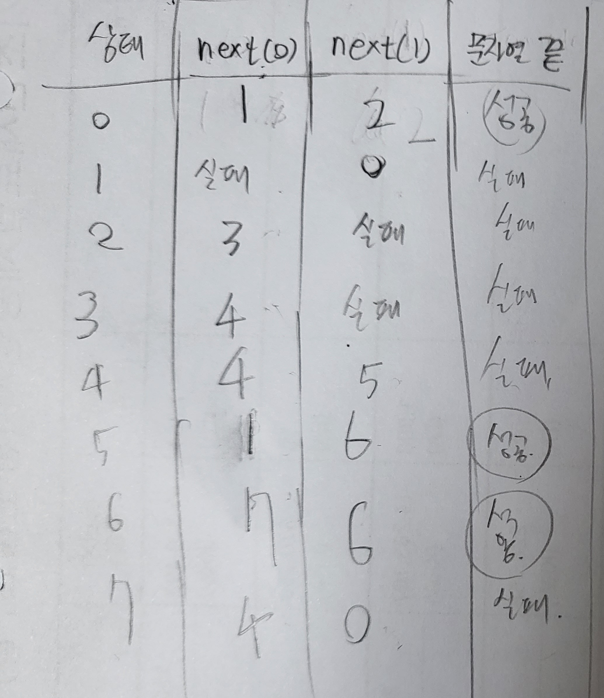

# 백준-1013 Contact

## 문제

- 백준, 골드5, [1013번: Contact (acmicpc.net)](https://www.acmicpc.net/problem/1013)
- 풀이 날짜: 2023.10.31
- 풀이 시간: 19:35~21:35(2시간)
- 알고리즘 분류: 문자열, 정규표현식

## 문제 해설

해당 문제를 요약하면 (100+1+ | 01)+ 꼴의 패턴이 나오면 YES, 아니면 NO를 출력하는 문제이다.

사실 정규식 때려박으면 해결될 문제인데 정규식을 못 써서 그냥 쌩으로 노가다 했다 ;(

두 가지 해결 방법이 있는데, 첫 번째는 문자열의 규칙성을 파악해서 하나 하나 문자를 처리하는 방식이다. 두 번째는 패턴이 존재하는 문자열을 인식하는 것이기 때문에 ‘결정적 유한 오토마타(DFA; Deterministic Finite Automata)’로 해결할 수 있다.

### 첫 번째 풀이

[코드](1013-1.cpp)

문자열 사이에 규칙성을 찾아서 푼다.

패턴을 하나씩 반복해서 처리해가며, 만약 문자열이 끝났을 때 패턴도 함께 끝났다면 성공으로 처리하는 방식이다.

예를 들어 `10010111`이 입력으로 들어오면 `1001`을 처리하고, `01`을 처리한 다음에 다음 11이 발견되는 것을 보고 실패로 간주하는 방식이다.

가지치기 방법으로 경우의 수를 센다. while문으로 하나의 패턴 블럭(완성된 하나의 패턴의 형태)씩 처리해가며, 현재 index부터 패턴이 시작된다고 가정한다.

가지치기로 진행을 하는데, 이를 구현하는 것이 더 어렵다는 문제가 있었다. 구현하고 나서도 정확하게 구현되었는지 알 수 없어 혼란을 만들 수 있다.

### 두 번째 풀이

[코드](1013-2.cpp)

문제가 도무지 해결되지 않아서 질문 게시판을 찾다가 상태도를 통한 해결 방법을 보게 되었다. 이건 확실하게 풀 수 있겠다 싶어서 이쪽으로 풀이 방법을 틀었다. 잘 보니까 출력 실수라서 이미 다 푼 상황이긴 했다마는…

두 번째 풀이는 결정적 유한 오토마타(DFA) 방법으로 해결하는 풀이이다. 

정해진 입력만이 나타나고(0, 1, 또는 문자열이 종료되는 케이스), 여러 상태가 동시에 나타나는 경우가 없으므로 유한 오토마타로 해석할 수 있다.

각 노드의 번호는 아래의 원 안에, 다음에 들어올 문자는 화살표 옆에 그리는 식으로 정리해보았다.

아래는 상태도이다. 0번 노드부터 시작된다.

이에 대한 상태표는 다음과 같다.

주의해야 할 점은 문자열이 끝날 때에도 상태마다 YES를 출력할지 NO를 출력할지 달라진다는 점이다. 이를 고려하여 각 상태마다 문자열이 끝날 때에 어떤 결과를 반환할지를 정해놓았다.

글씨체가 더러운데, 0, 5, 6 상태에서 문자열이 끝날 때 성공(true)을 반환한다.

## 어려웠던 점

풀이 과정 중에서 대문자(YES, NO)로 출력해야 되는 걸 Yes, No로 출력하는 바람에 1시간동안 문제를 알아차리지 못했다.

그걸 제외하더라도 1시간만에 푼 셈이니, 시간이 많이 걸린 것은 사실이다.