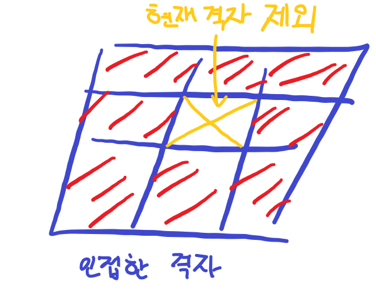

# 백준-1245 농장 관리

## 문제

- 백준, 골드5, [1245번: 농장 관리 (acmicpc.net)](https://www.acmicpc.net/problem/1245)
- 풀이 날짜: 2024.01.25.
- 풀이 시간: 15:21~15:52 (31분)
- 알고리즘 분류: 그래프 탐색

## 문제 해설

이 문제는 산봉우리의 개수를 구하는 문제이다.

산봉우리는 하나의 칸 혹은 인접한 격자의 집합으로 구성될 수 있다. 그러니 높이가 같으면서 붙어있는 칸들은 전체가 산봉우리가 되거나 산봉우리가 아니거나 둘 중 하나가 된다.

따라서 입력으로 들어온 격자의 높이를 하나의 그래프로 보고, 그래프 탐색 방법을 통해 인접한 모든 칸을 탐색하여 산봉우리인지 아닌지를 조사해야 한다.

문제 설명에 따르면 산봉우리의 정의는 다음과 같다.

> 산봉우리의 정의는 다음과 같다. 산봉우리는 같은 높이를 가지는 하나의 격자 혹은 인접한 격자들의 집합으로 이루어져 있다. (여기서 "인접하다"의 정의는 X좌표 차이와 Y좌표 차이 모두 1 이하일 경우로 정의된다.) 또한 산봉우리와 인접한 격자는 모두 산봉우리의 높이보다 작아야한다.
> 

인접한 격자와 현재 격자가 높이가 같으면 인접한 격자와 또 인접한 격자를 탐색해야 한다.

반대로 인접한 격자가 현재 격자보다 **높이가 높다면**, 해당 격자는 산봉우리가 아니게 된다. 따라서 이 격자와 높이가 같은 격자도 모두 **산봉우리가 아니다.**

**그 이외**의 경우에는 산봉우리의 높이보다 인접한 격자가 **높이가 작은 경우**이므로 산봉우리의 조건을 만족한다.

이때, 문제에서 주어진 “인접”의 정의에 따라 인접한 격자는 왼쪽 위부터 오른쪽 아래까지 3x3 공간이 되겠다(단, 현재 격자 제외).

### 구현

해당 문제를 풀기 위해 DFS 방식으로 격자를 탐색할 것이다.

이때, 인접한 격자를 확인할 때마다 다음 경우를 확인해야 한다.

1. 현재 격자보다 높이가 클 경우
    - 인접한 격자가 더 높으니 현재 격자는 산봉우리가 아니다.
2. 인접한 격자와 높이가 같은 경우
    - 이미 방문한 격자라면, 중복 방문하지 않는다.
    - 방문하지 않은 격자라면 DFS 방식으로 방문한다. 높이가 같고 인접한 격자가 산봉우리가 아니라면 현재 방문 중인 격자도 산봉우리가 아닐 것이다. 따라서 인접한 격자가 산봉우리인지 아닌지 확인한다.

범위 밖일 경우 검사하지 않는다.

이러한 방식으로 모든 격자를 방문하여, 산봉우리인 격자의 집합의 개수를 구한다.