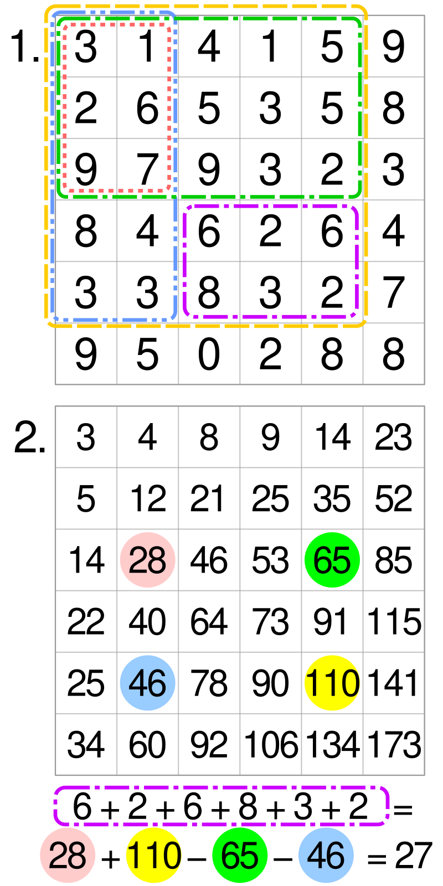
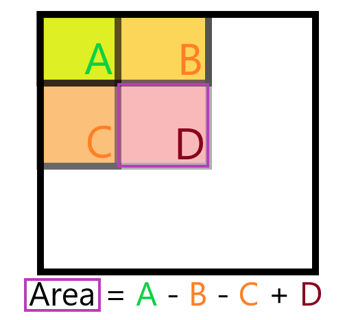
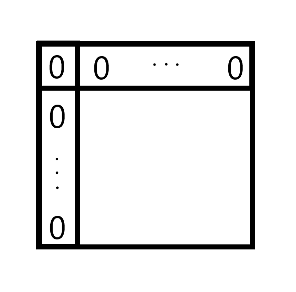
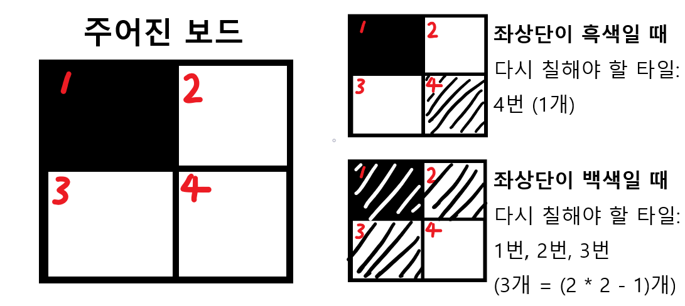
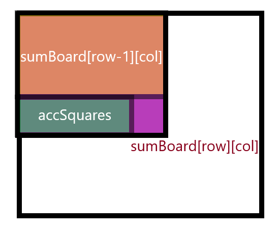
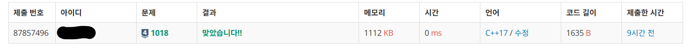

# 1018번-체스판 다시 칠하기

## 문제

- 백준, 실버4, [1018번: 체스판 다시 칠하기](https://www.acmicpc.net/problem/1018)
- 풀이 날짜: 2024.12.27
- 풀이 시간: 11:37~12:07
- 알고리즘 분류: 브루트포스 알고리즘
- 사용 언어: C++

## 문제 해설

해당 문제는 MxN 보드에서 조건을 만족하는 8x8 부분 보드를 찾는 문제이다.

이때, 체크무늬 형태로 보드를 색칠해야 하는데, 체스판 보드의 색상은 잘못 칠해져 있을 수도 있으므로 체크무늬 형태로 칠해야 한다. 색은 하양, 검정 두 개가 있는데, 좌측 상단이 검정으로 시작할 수도 있고 하양으로 시작할 수도 있으므로 두 케이스를 모두 검사해야 한다.

가장 먼저 모든 경우의 수를 브루트포스로 접근하는 방법이 있다. 시간 복잡도를 보자면, 8*8 보드를 검사해야 하므로 (N-8) * (M - 8) 보드에 대해 부분 보드를 검사해야 하며, 8*8 보드를 검사할 때에 8*8번만큼 검사가 필요하므로 64 * (N - 8) * (M - 8) ~ O(NM), 즉 O(N^2)의 시간 복잡도가 나타난다.

N, M의 범위가 8 ≤ N, M ≤ 50이므로 시간 복잡도는 큰 문제가 안된다.

다만, 이번에 내가 계산할 땐 검사하는 보드의 크기가 상수 크기(8*8=64)로 고정되어 있음을 고려하지 않아 시간 복잡도가 O(N^4)이라고 판단했다. 그래서 좀 더 시간 소요를 줄이기 위해 적분 영상(Integral Image) 방식을 사용하기로 하였다.

### **Summed-area table 알고리즘과 적분 영상(Integral Image)**

Summed-area table 알고리즘이란, 빠르고 효율적으로 직사각형에서 부분집합 영역의 합을 구하는 자료구조이자 알고리즘이다. 특히, 이미지 처리 분야에서 적분 영상(Integral image)으로 알려져 있다고 한다(wikipedia 발췌).

적분 영상 알고리즘은 컴퓨터 비전 분야에서 2001년 얼굴을 탐지하는 논문 Viola Jones detector에서 활용된 것으로 유명하다.

적분 영상은 이전 픽셀에서 다음 픽셀까지의 합을 각 픽셀에 저장한 영상이다. 쉽게 말하면, 각 픽셀별로 좌측 상단 픽셀부터 자기까지 오는 직사각형 영역의 넓이를 기록하는 것이다.

[https://wikimedia.org/api/rest_v1/media/math/render/svg/c0446cbb98b354c775cace4853a3aa0ba093ded6](https://wikimedia.org/api/rest_v1/media/math/render/svg/c0446cbb98b354c775cace4853a3aa0ba093ded6)

이미지로 보면 이렇다.



(출처: 위키백과 Summed-area table)

위에 6x6 형태의 2차원 배열을 표현해놓았다.

1번 이미지가 바로 원본 배열이다.

원래에는 특정 영역의 넓이를 구하려면, 해당 영역에 속한 모든 요소를 순회하며 그 합을 더해야 한다.

2번 이미지가 바로 1번의 적분 영상(Integral Image)을 구한 것이다.

예를 들어서, 2번 이미지에서 빨강 사각형으로 되어 는 28은 제일 왼쪽 위에 있는 3부터 시작해서 자신의 위치까지 *주황색 직사각형* 내에 있는 값을 더한 것이다.

이렇게 왼쪽 위부터 시작해서, 자기 위치까지 모두 더한 값들을 모두 구하면, 적분 영상을 구할 수 있다.

적분 영상의 장점은 특정 직사각형 부분의 넓이를 빠르게 구할 수 있다는 것이다. 예를 들어, 1번 이미지에서 보라색 직사각형 영역의 합을 구하고 싶으면, 원래에는 6 + 2 + 6 + 8 + 3 + 2와 같이 각각의 값을 더해야 한다. 적분 영상을 이용한다면, 간단하게 28 + 110 - 65 - 46 = 27와 같이 네 번의 산술연산으로 처리할 수 있다.

이렇게 되는 이유는, 1번 이미지에서 보라 사각형의 넓이를 구하려면  노랑 사각형(110)에서 초록 사각형(65), 파랑 사각형(46)을 빼야 하고 중복으로 제외된 주황 사각형(28)을 더해주는 식으로 계산해야 하기 때문이다. 이를 정리하면 아래와 같다.



### 코드 보기

각 부분을 살펴보자.

먼저, 초기에 적분 배열을 위해 초기화 작업을 거친다.

이때 주의할 점은, 보드 크기가 8*8일 때 적분 영역을 구하기 어렵다는 것이다. 그래서, 가장 위에 있는 행과 가장 좌측에 있는 열은 0으로 Padding을 채워준다.



아래와 같이 초기화한다.

```cpp
int N, M;
scanf("%d %d", &N, &M);

// 적분 배열 생성
int sumBoard[51][51]; // (N+1)*(M+1), 첫 칸은 0
char line[51];

// 초기화
for (int i = 0; i <= N; i++)
    for (int j = 0; j < M; j++)
        sumBoard[i][j] = 0;
```

다음으로는 적분 영상을 생성한다.

이때 BWBW… 와 같이 보드 형태로 된 것을 0, 1로 된 이진 영상으로 변환해준다.

이때 무엇을 값으로 지정할지가 문제가 된다. 해당 문제에서는 좌상단이 흑색부터 시작하도록 칠해야 할 수도 있고, 좌상단이 백색으로 시작하도록 칠해야 할 수도 있다.

다만 이 부분은 크게 신경쓰지 않아도 되는데, 좌상단을 흑색으로 칠했을 때와 백색으로 칠했을 때 다시 칠해야 하는 개수는 바로 구할 수 있기 때문이다.



2x2 보드가 위와 같이 주어지면, 좌상단이 흑색으로 시작해야 한다면 4번 타일, 즉 1개만 다시 칠하면 된다.

하지만 좌상단이 백색으로 시작해야 한다면 4번 타일을 제외한 모든 타일, 즉 (2*2 - 1)개 = 3개를 다시 칠해야 한다.

이 규칙은 크기를 키워도 그대로 적용된다. 좌상단이 **흑색**이 되도록 하려면 k개의 타일을 다시 칠해야 한다고 하자. 그러면 좌상단이 **백색**이 될 땐 k개를 제외한 나머지 타일, 즉 (8*8 - k)개 타일을 다시 칠하면 된다.

따라서 좌상단이 흑색으로 시작한다고 가정해도 나중에 다시 결과를 구하는 것은 간단하다.

그러니 좌상단이 흑색으로 시작한다고 가정하고, 각 위치에서의 값은 다시 칠해야 할 경우 1, 아닐 경우 0으로 기록하도록 한다.

```cpp
for (int row = 1; row <= N; row++)
{
    int accSquares = 0;
    scanf("%s", line);
    
    for (int col = 1; col <= M; col++)
    {
        // 좌상단이 흑색이라 가정하고, 좌측 위부터 현재 노드까지 직사각형 범위에서 
		    // 다시 칠해야 하는 사각형 합을 구함
        accSquares += ((row + col) % 2 == 0) ?
            line[col - 1] != 'B' : line[col - 1] != 'W';
        sumBoard[row][col] = sumBoard[row-1][col] + accSquares;
    }
}
```

위 코드에서 accSquares라는 변수가 나오는데, 이는 적분 영역을 구하기 위해 도입한 변수다. row행 col열에서 적분 영역을 구할 때, 아래와 같이 볼 수 있다.



구하고자 하는 값은 현재 적분 영역 `sumBoard[row][col]`로, 바로 위 행에서의 적분 영역 sumBoard[row-1][col]과 현재 행에서의 누적 값 accSquares를 더해서 구할 수 있다.

이때 accSquares는 각 타일에서 다시 칠해야 하면 1, 아니면 0을 더하도록 하는데, 좌측 상단이 검은색으로 시작한다면 (row + col)은 짝수일 때 검은색, 홀수일 때 흰색이어야 한다.

예를 들어, 1행 1열에서는 검정이 나와야 하는데, (1 + 1) % 2 = 0이므로 검정이다.

어쨌거나 잘못 칠해져 있을 때 1이 나와야 하니 따라서 그 반대가 되도록 다음과 같이 구한다(

```cpp
accSquares += ((row + col) % 2 == 0) ?
    line[col - 1] != 'B' : line[col - 1] != 'W';
```

(반대로 구해도 되는데, 왜냐하면 값을 바꿔도 좌측 상단이 흰색이라고 가정하는 것과 같으므로 결국은 나중에 칠해야 할 최소 개수를 구할 때 같은 답이 나온다.)

이렇게 해서 적분 영상 형태로 구하고 나면, 이를 활용해서 다시 칠해야 할 사각형의 최소 개수를 최종적으로 구해야 한다. 

적분 영역으로 다시 칠할 사각형의 최소 개수를 구할 땐, 처음 8칸을 제외하고 나머지 영역에 대해 for문으로 순회해주자.

```cpp
// 8x8 보드를 순회하며 다시 칠해야 할 사각형의 최소 개수 구하기
int minSquares = 8*8;
for (int row = 8; row <= N; row++)
{
    for (int col = 8; col <= M; col++)
    {
        // A - B
        // |   |
        // C - D
        // 에 대하여 ABCD 범위의 합은 (D + A - B - C)
        int squares = sumBoard[row][col] 
            + sumBoard[row - 8][col - 8]
            - sumBoard[row - 8][col]
            - sumBoard[row][col - 8];
        if (squares > 8 * 8 - squares)
            squares = 8 * 8 - squares; // 처음을 흰색으로 칠할 때 개수
        if (minSquares > squares)
            minSquares = squares;
    }
}
```

한 가지 주의해야 할 부분이 있다면 다음 코드이다.

```cpp
if (squares > 8 * 8 - squares)
    squares = 8 * 8 - squares; // 처음을 흰색으로 칠할 때 개수
```

좌상단을 검정으로 가정했을 때 다시 칠해야 할 사각형의 수를 구했는데, 그게 흰색에 비해 더 큰 경우이다. 흰색일 때 다시 칠해야 하는 개수는 위에서 (8*8 - squares)개라고 설명했는데, 그것을 고려하는 게 바로 이 부분이다.

이렇게 구하고 나면 정상적으로 결과가 나오게 된다.



다만 애초에 문제의 N이 너무 작아서 브루트포스로 구해도 0ms가 나온다. 알고리즘 문제 풀 땐 지금처럼 필요없이 과도하게 최적화하지 않는 것이 좋을 것 같다…

궁금해서 한번 실제 브루트포스 방법과 적분 영상 방법을 비교해보기로 했다.

사용한 브루트포스 방법은 다음과 같다.

```cpp
int invalidArea(char board[50][51], int row, int col)
{
    // 8*8 영역에 대해 잘못 칠해진 사각형의 최솟값을 계산합니다.
    int squares = 0;
    for (int i = 0; i < 8; i++)
    {
        for (int j = 0; j < 8; j++)
        {
            squares += (row + i + col + j) % 2 == 0 ?
                board[row + i][col + j] == 'W' : board[row + i][col + j] == 'B';
        }
    }
    if (squares > 8 * 8 - squares)
        squares = 8 * 8 - squares;
    return squares;
}

int solvedByBrute(char board[50][51], int N, int M)
{
    int minSquares = 100;
    for (int i = 0; i <= N - 8; i++)
    {
        for (int j = 0; j <= M - 8; j++)
        {
            int area = invalidArea(board, i, j);
            if (area < minSquares)
                minSquares = area;
        }
    }
    return minSquares;
}
```

그리고 시간 비교는 입력을 제외하고 오직 알고리즘 동작 시간만 비교했으며, 4번 입력 예제를 사용했다.

1번만으로는 비교가 정확히 안돼서 10만 번을 돌렸을 때 아래와 같은 차이를 얻을 수 있었다.


결과 시간의 차이는 4배 정도나 나기는 했으나 10만 번 돌렸을 때 브루트포스 방법도 겨우 316ms 걸린 게 전부이다. 워낙 입력 크기가 작아서 여기에서는 최적화하는 게 오히려 과도한 것으로 보인다.

## 참고

[Summed-area table - Wikipedia](https://en.wikipedia.org/wiki/Summed-area_table)

[살다보니.. :: Integral Image ( 적분 영상 )](https://jangjy.tistory.com/32)