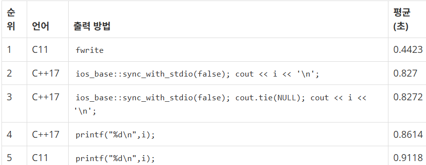
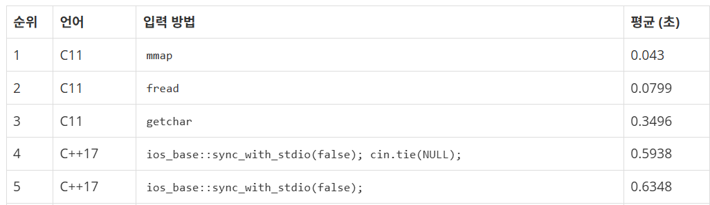

# 11286번-절댓값 힙

## 문제

- 백준, 실버1, [11286번: 절댓값 힙](https://www.acmicpc.net/problem/11286)
- 풀이 날짜: 2025.01.01, 01.04.
- 풀이 시간: 21:53~23:08(1월 1일), 17:18~17:26(1월 4일) (75분 + 8분)
- 알고리즘 분류: 자료구조, 우선순위 큐
- 사용 언어: C++

## 문제 해설

해당 문제는 우선순위 큐를 구현하는 문제이다.

삽입된 원소에 대해 우선순위에 따라 정렬하여 반환하는데, 이때 원소가 중간에 삽입되고 삭제되기를 반복하므로 원소를 삽입할 때마다 정렬하면 시간 복잡도가 O(N^2)에 도달한다.

따라서 효율적으로 하기 위해 우선순위 큐, 특히 Heap을 활용하는 방법을 활용해야 한다(시간 복잡도: O(NlogN)).

정렬 기준은 절대값이 가장 작은 값을 우선으로 하며 절대값이 같을 경우 값이 가장 작은 데이터를 우선으로 출력하도록 한다.

### 힙 구현하기

우선, 직접 힙을 구현하는 방법을 사용했다.

이를 위해 compare 함수를 아래와 같이 구성하였다.

```cpp
int abs(int num)
{
    return num >= 0 ? num : -num;
}

// -1이면 a, 1이면 b가 작음
int compare(int a, int b)
{
    if (abs(a) == abs(b))
    {
        if (a == b) return 0;
        else return a < b ? -1 : 1;
    }
    return abs(a) < abs(b) ? -1 : 1;
}
```

0이 들어오면 원소를 pop하고, 0이 아닌 원소가 들어오면 원소를 삽입(push)한다. 이를 위한 함수는 heap에 따라 구현했다.

이때 발생한 문제는, Pop을 위한 함수 HeapPop에서 child 값은 idx * 2로 설정하는데 idx는 최초에 설정한 값에서 더이상 변경하지 않도록 짜버리는 실수를 저질렀다.

그로 인해 문제가 해결되지 않았는데, 다음부터는 잘 풀리지 않을 때 테이블을 그리고 한 단계씩 해야 할 절차를 수행해보며 생각하는 연습을 해야겠다.

데이터 자료구조는 heap이라는 배열을 활용하였으며, 가장 첫 원소(index = 0)는 비우고 index = 1부터 계산하도록 했다. 이렇게 하면 (index * 2)의 원소는 (index) 원소의 왼쪽 자식 원소, (index * 2 + 1)번째 원소는 (index) 원소의 오른쪽 자식 원소가 된다.

```cpp
#include <cstdio>
#include <vector>

using namespace std;

vector<int> heap;

int HeapPop()
{
    int top = heap[1];
    int idx = 1;
    int child = idx * 2;
    
    heap[1] = heap[heap.size() - 1];
    heap.pop_back();

    while (child < heap.size())
    {
        if (child + 1 < heap.size() && compare(heap[child], heap[child + 1]) > 0)
            child = child + 1;
        if (compare(heap[idx], heap[child]) < 0)
            break;
        
        int temp = heap[idx];
        heap[idx] = heap[child];
        heap[child] = temp;

        idx = child;
        child = idx * 2;
    }

    return top;
}

void HeapPush(int n)
{
    int idx = heap.size();
    int temp;

    heap.push_back(n);

    while (idx > 1)
    {
        if (compare(heap[idx / 2], heap[idx]) < 0)
            return;
        temp = heap[idx / 2];
        heap[idx / 2] = heap[idx];
        heap[idx] = temp;
        idx /= 2;
    }
}
```

처리할 땐 간단하게 처리했다.

```cpp
int main()
{
    int n, input;

    scanf("%d", &n);

    heap.push_back(0); // padding

    for (int i = 0; i < n; i++)
    {
        scanf("%d", &input);

        if (input == 0)
        {
            if (heap.size() <= 1)
                printf("%d\n", 0);
            else
                printf("%d\n", HeapPop());
        }
        else
        {
            HeapPush(input);
        }
    }

    return 0;
}
```

다만 이렇게 하면 힙 구현에 실수가 생기면 문제가 생기게 된다.

실수 한 번을 했더니 30분동안 찾아도 문제를 찾을 수 없었고, 며칠 쉬고 와서 다시 보니 8분만에 문제를 발견하고 해결하게 되었다.

그래서 일반적으로는 이미 구현 완료된 STL을 사용하는 것이 좋다.

### Priority Queue STL 활용하기

```cpp
template<
    class T,
    class Container = std::vector<T>,
    class Compare = std::less<typename Container::value_type>
> class priority_queue;
// 위에서부터 타입, 컨테이너, Compare 컨테이너
// 출처: https://en.cppreference.com/w/cpp/container/priority_queue
```

C++에서는 헤더파일 <queue>에서 우선순위 큐 std::priority_queue를 제공한다.

기본 제공하는 메서드에는 push, pop, top, empty, size가 있으며 이는 queue와 동일하다.

참고: [[C++ STL] Priority_queue 사용법](https://kbj96.tistory.com/15)

이때 선언할 때 우선순위를 결정하는 두 방법이 있다.

첫 번째는 타입 자체에서 지원하는 less 함수를 설정하는 방법이고(std::less 오버로딩), 두 번째는 std::less 함수 자체를 주는 방법이다.

기본적으로 PriorityQueue는 최소 값 우선 정렬을 하는데, 만약 오름차순 정렬을 하려면 이렇게 해야 한다.

```cpp
priority_queue<int, vector<int>, greater<int>> pq;
```

하지만 더 복잡한 비교 함수가 필요하다면 직접 선언해야 한다.

첫 번째는 타입 자체에서 operator<를 지정해서 선언하는 것이고,

```cpp
struct Student {
    int id;
    int math, eng;
    Student(int num, int m, int e) : id(num), math(m), eng(e) {}
 
    bool operator<(const Student s) const {
        return this->id > s.id;
    }
};

priority_queue<Student> pq;
// 출처: https://kbj96.tistory.com/15
```

두 번째는 compare 구조체를 지정해주는 방법이다.

```cpp
struct cmp {
    bool operator()(Student a, Student b) {
        return a.id < b.id;
    }
};

// 위에서 만든 cmp 구조체를 넣어 준다.
priority_queue<Student, vector<Student>, cmp> pq;
```

이때, 비교를 위한 함수를 작성해줄 때 주의해야 한다.

바로, Strict Weak Ordering의 원칙에 맞추어 작성해야 한다.

> 아래 네 원칙을 만족하는 관계 R은 Strict Weak Ordering이다.
> 
> 1. 비반사성(irreflexivity): 모든 x에 대해 R(x, x)는 거짓
> 2. 비대칭성(asymmetry): 모든 x, y에 대해 R(x, y)가 참이면 R(y, x)는 거짓
> 3. 추이성(transitivity): 모든 x, y, z에 대해 R(x, y)와 R(y, z)가 참이면 R(x, z)는 참
> 4. 비비교성의 추이성(transitivity of incomparability): 모든 x, y, z에 대해 R(x, y)와 R(y, x)가 거짓이고 R(y, z)와 R(z, y)가 거짓이면 R(x, z)와 R(z, x)는 거짓
> 
> 참고: [Strict Weak Ordering](https://panty.run/strict-weak-ordering/)
> 

즉, a≤b는 비대칭성을 만족하지 못하므로(a≤b가 참인데 b≤a가 참인 a, b가 존재한다(a==b)), 사용하면 안되는 관계가 된다.

그에 따라 관계를 작성하면 이렇게 된다.

```cpp
bool operator()(int a, int b)
{
    if (abs(a) == abs(b))
    {
        return a < b;
    }
    return abs(a) < abs(b);
}
```

다만 여기서 좀 헷깔리는 점이, std::less를 사용하면 큰 수부터 pop하고, std::greater를 사용하면 작은 수부터 pop한다는 점이다.

즉, 기본적으로 priority_queue는 최대힙이다.

> The [priority queue](https://en.wikipedia.org/wiki/Queue_(abstract_data_type)) is a [container adaptor](https://en.cppreference.com/w/cpp/container#Container_adaptors) that provides constant time lookup of the largest (by default) element, at the expense of logarithmic insertion and extraction.
[std::priority_queue - cppreference.com](https://en.cppreference.com/w/cpp/container/priority_queue)
> 

따라서 최소인 a부터 꺼내려면, 부호를 반대로 해야 한다.

그래서 다음과 같이 compare를 만든다.

```cpp
struct compare
{
    bool operator()(int a, int b)
    {
        if (abs(a) == abs(b))
        {
            return a > b;
        }
        return abs(a) > abs(b);
    }
    
    int abs(int num)
    {
        return num >= 0 ? num : -num;
    }
};

```

main을 포함한 코드는 이렇다.

```cpp
#include <iostream>
#include <queue>
#include <vector>

int main()
{
    std::ios_base::sync_with_stdio(false);
    std::cout.tie(NULL);

    std::priority_queue<int, std::vector<int>, compare> pq;
    int n;

    std::cin >> n;

    int input;
    for (int i = 0; i < n; i++)
    {
        std::cin >> input;
        if (input == 0)
        {
            if (pq.empty())
                std::cout << 0 << '\n';
            else
            {
                std::cout << pq.top() << '\n';
                pq.pop();
            }
        }
        else
        {
            pq.push(input);
        }
    }
    return 0;
}
```

그런데 이렇게 제출했더니 시간이 엄청 많이 걸렸다. 원인이 대체 뭘까?

원인은 `cout.tie(NULL);`이었다.

### cin.tie(NULL)

cout.tie가 아니라 cin.tie(NULL)을 호출해야 한다.

실제 백준에서 비교해본 걸 보면, cout.tie(NULL);는 하나 마나 사실 속도 차이가 거의 없다. 출력에 있어서는 tie가 큰 효과가 없는 셈이다.


출처: https://www.acmicpc.net/blog/view/57

그런데 출력뿐만 아니라 입력에서도 시간이 걸린다는 점을 유의해야 한다.


출처: https://www.acmicpc.net/blog/view/56

입력 속도에서도 비교해보면, cin.tie(NULL)을 해주냐 마냐에 따라서 시간차가 많이 나타나는 걸 볼 수 있다.

이러한 시간 문제가 발생하는 이유는 cin과 cout은 사실 커플링되어 있기 때문이다.

입력을 모두 받고 나서, 그 다음 출력을 하고, 출력이 끝난 다음에 입력을 받는 식으로 기다리는 시간으로 인해 소모되는 시간이 발생한다. 결국 말하자면, flush로 버퍼를 비워주는 시간 때문이다.

> cin과 cout은 서로 연결되어있어서 cin을 쓰면 출력 버퍼를 비우고 입력이 발생한다.
> 
> 
> 이러한 플러시 과정(버퍼를 비우는 작업)도 시간이 든다.
> 
> 그래서 cin, cout의 상호 연결을 끊어주기 위해 cin.tie(NULL);를 사용한다.
> 
> https://velog.io/@matcha_/%EB%B0%B1%EC%A4%80-C-cin-cout-%EC%9E%85%EC%B6%9C%EB%A0%A5-%EC%86%8D%EB%8F%84-%EB%B9%A0%EB%A5%B4%EA%B2%8C-%ED%95%98%EB%8A%94-%EB%B2%95
> 

cin.tie(NULL)은 이러한 커플링을 제거하는 방법이다.

그래서 사실은, cin.tie(NULL)을 사용해야 하는 케이스는 입력과 출력을 번갈아가며 수행할 때이다.

현재 코드는 정확히 그 케이스이다. 입력과 출력을 번갈아가며 수행하니 플러시 과정으로 버퍼를 비워주는 시간이 반복적으로 생기게 된다.

```cpp
// 문제의 부분
for (int i = 0; i < n; i++)
{
    std::cin >> input;
    if (input == 0)
    {
        if (pq.empty())
            std::cout << 0 << '\n';
        else
        {
            std::cout << pq.top() << '\n';
            pq.pop();
        }
    }
    else
    {
        pq.push(input);
    }
}
```

이 경우엔 cin.tie(NULL);로 해결해도 되고, 입력을 모두 마친 후에 한번에 출력하는 식으로 해결해도 시간을 줄일 수 있다. 둘 중 하나만 해도 시간 문제는 해결된다.

```cpp
int main()
{
    std::ios_base::sync_with_stdio(false);
    std::cin.tie(NULL);

    std::priority_queue<int, std::vector<int>, compare> pq;
    std::vector<int> result;
    int n;

    std::cin >> n;

    int input;
    for (int i = 0; i < n; i++)
    {
        std::cin >> input;
        if (input == 0)
        {
            if (pq.empty())
                result.push_back(0);
                // std::cout << 0 << '\n';
            else
            {
                result.push_back(pq.top());
                // std::cout << pq.top() << '\n';
                pq.pop();
            }
        }
        else
        {
            pq.push(input);
        }
    }

    // 마무리 출력 과정
    for (int i = 0; i < result.size(); i++)
    {
        std::cout << result[i] << '\n';
    }

    return 0;
}
```
