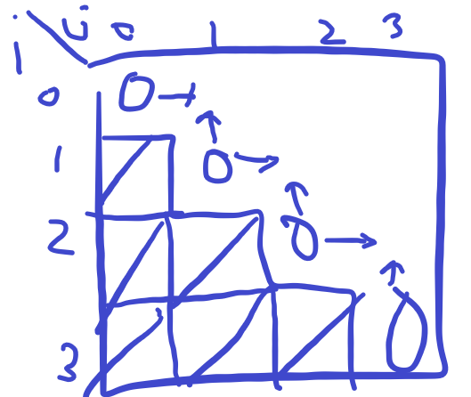

# 11049번-행렬 곱셈 순서

## 문제

- 백준, 골드 3, [https://www.acmicpc.net/problem/11049](https://www.acmicpc.net/problem/11049)
- 풀이 날짜: 2025.3.3., 3.4.
- 풀이 시간: 25.3.3: 16:17~17:33(1시간 16분, 보류)
  - 2025.3.4: 11:55~12:40, 15:30~17:27(16시부터 다른 사람 풀이 확인함)
- 알고리즘 분류: 다이나믹 프로그래밍
- 사용 언어: C++

## 문제 해설

이번 문제는 풀다가 결국 해설을 찾아보았다.

해당 문제를 2차원 dp로 접근할 수 있다는 점과, “dp[i][j]는 i번째 행렬부터 j번째 행렬까지 곱했을 때 최소 연산 비용”으로 정의할 수 있다는 점을 알고 나서야 풀 수 있었다. 그 점에서 좀 반성할 만한 문제이다.

### 문제 접근 방식

다이나믹 프로그래밍 같지 않아 보이는 다이나믹 프로그래밍 문제이다.

입출력 예제를 몇 개 더 만들다 보면 알겠지만, 특별한 수학적 풀이법이 존재하지 않는 문제이다.

예를 들어, 예제 입출력 1에 대해

```cpp
// 예제 입출력 1
3
5 3
3 2
2 6
```

를 보면, 5 \* 3과 3 \* 2 행렬을 먼저 곱하는 것을 보고 “중간에 끼는 값이 큰 쪽을 먼저 곱한다”고 생각할 수 있다.

하지만 다른 입출력을 세워보면, 그렇지 않다.

```cpp
// 내가 만든 입출력 1
4
5 100
100 3
3 20
20 5
```

분명 위와 같은 상황에서는 5 \* 100과 100 \* 3을 먼저 곱하는 게 유리하지만,

```cpp
// 내가 만든 입출력 2
3
100 50
50 60
60 500
```

위와 같이 또 다른 상황에서는, 중간 값이 최대가 되는 50 \* 60과 60 \* 500을 먼저 행렬 곱셈을 해버리면 오히려 결과 행렬로 50 \* 500이 생겨버리면서 오히려 계산이 비효율적이게 된다.

따라서, 이렇다 할 규칙을 찾기 어려워서 사실상 모든 경우의 수를 따져보도록 해야 한다.

그런데 여기서 문제는, 무작정 모두 다 곱해보는 식으로 계산하면 경우의 수가 너무나도 많아진다.

예를 들어 A(B(CD))와 a((BC)D)는 똑같이 BCD가 곱해진 상태에서 A와 행렬 곱셈을 수행하는 상황이다. BCD의 값은 어떻게 곱하든 똑같다. 따라서, 위 두 가지 경우는 하나로 합쳐주는 작업이 필요하다. 즉, BCD의 연산에 필요한 최솟값을 구한 다음 A(BCD)를 구하여야 한다.

여기서 계산하는 순서를 보면 미리 결과를 계산해놓은 다음 접근하는 방식을 사용하므로, 다이나믹 프로그래밍을 사용한다고 말할 수 있겠다.

### 실수한 점

다만 여기에서 실수했는데, 각 상태를 중복 방문하면 안된다고 생각하고, 비트필드를 통한 다이나믹 프로그래밍으로 접근해버린 것이 문제이다.

예를 들어, A(B(CD))와 A((BC)D)는 BCD를 먼저 계산하고 A를 계산한다는 점에서 똑같으므로, B, C, D 사이에는 이미 연산을 마쳤다고 표시해주도록 하는 것이다. 하나도 서로 곱하지 않은 상태에서 ABCD는 A|B|C|D로 표현할 수 있고, B, C, D 사이에는 서로 곱했을 때 A(BCD)는 A|BCD로 표현하도록 하는 것이다.

그런데 몇 번째 자리에 칸막이가 있는지는 알 수가 없다 보니, 이를 표현하기 위해 A, B 사이에 칸막이가 있는지, B, C 사이에 칸막이가 있는지, C, D 사이에 칸막이 있는지 0과 1로 표현하도록 한다. 그러면 A|B|C|D는 111로, A|BCD는 1000과 같이 표현할 수 있다고 생각했다.

즉, 비트필드를 통해 상태를 저장하고, 그 상태를 통해 최적의 곱셈 순서를 구성하는 것이다.

다만 이렇게 하면 생기는 문제가, 하나의 상태마다 500개의 비트가 필요하다는 점이고, 최대 필요한 상태의 개수가 $2^{500}$개의 상태가 필요하다는 점이다. 모든 비트가 0과 1이고, 행렬 개수가 500개이므로 상태의 개수가 너무 많아진다. 즉, 이를 저장하기만 해도 $500 * 2^{500}$개라는 말도 안 되는 상태가 필요하다.

실제로 이로 인해, 메모리 초과가 발생했다.

### 현실적인 풀이

여기에서는 꼭 비트필드를 활용해야 한다는 고정관념에 사로잡혔었는데, 반대로 ‘부분합’ 개념을 이용하면 기본 DP로도 문제를 해결할 수 있다.

ABCD에서 BCD의 결과는 B(CD) 또는 (BC)D로 구할 수 있다. 이때 CD를 계산하는 데에 필요한 비용과 BC를 계산하는 데에 필요한 비용을 저장하기만 한다면, BCD를 계산하는 비용은 손쉽게 계산할 수 있다. 다른 방식으로 접근해서, 아예 i번째부터 j번째 행렬을 곱한 비용만 저장하도록 하면 이 계산 비용을 저장할 수 있다.

이렇게 접근하면 좋은 점이, i가 가리키는 행렬은 0~499번째 행렬이 될 수 있고 j도 0부터 499까지 가리킨다. 즉, 500 \* 500개의 저장 공간, 25,000개의 정수 비용만 저장하면 DP 결과를 저장할 수 있다.

해당 풀이 방법은 다음을 참고하였다.

- https://ddiyeon.tistory.com/72
- [**synthesis**](https://www.acmicpc.net/user/synthesis)님 백준 풀이: https://www.acmicpc.net/source/share/94d2c61528dd4309859d79c7b36324a0

여기에서는 2차원 DP로 문제를 해결하도록 한다.

dp[i][j] = i번째 행렬부터 j번째 행렬까지를 곱할 때 최소 비용이라 하자.

1. 기본 dp 값은 int의 최댓값으로 설정한다(최소 비용을 구해야 하므로, 초기에는 최대로 설정).
2. 먼저 대각선을 채운다.
   1. 단일 행렬 자체는 계산 비용이 없으므로, 0≤i≤n-1에 대해 dp[i][i] = 0으로 채운다.
3. 이미 채운 칸의 이웃한 칸을 채운다.

   1. dp[i][j]는 i~k번째 행렬까지의 곱과 (k+1)~j번째 행렬의 곱에 필요한 비용을 구하고, 거기에 (i~k번째 행렬) \* ((k+1)~j번째 행렬)에 필요한 비용을 더해 구할 수 있다.
   2. 즉, `dp[i][j] + dp[j+1][i+k] + rows[i] * cols[j] * cols[i+k]`
   3. 단, 기존 비용보다 더 작을 때에만 값을 갱신한다.
   4. 또한, i≤j이도록 값을 제한한다.

   

4. 이렇게 해서, dp[0][n-1]이 채워지면, 이를 반환한다!

이런 식으로 부분합으로도 접근할 수 있다는 사실을 유의하도록 하자!

구현 코드는 다음과 같다.

```cpp
#include <iostream>
#include <climits>
#include <algorithm>

using namespace std;

int main()
{
    int dp[500][500];
    int n;
    int rows[500], cols[500];

    cin >> n;

    for (int i = 0; i < n; i++)
        fill_n(dp[i], n, INT_MAX);
    for (int i = 0; i < n; i++)
    {
        cin >> rows[i] >> cols[i];
        dp[i][i] = 0;
    }
    for (int k = 1; k < n; k++)
    {
        for (int i = 0; i < n - k; i++)
        {
            for (int j = i; j < i + k; j++)
            {
                dp[i][i+k] = min(dp[i][i+k], dp[i][j] + dp[j+1][i+k] + rows[i] * cols[j] * cols[i+k]);
            }
        }
    }

    cout << dp[0][n-1] << '\n';

    return 0;
}
```
