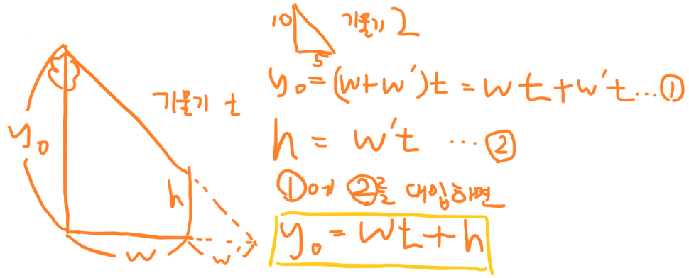

# 33278번-나무와 그림자 easy

## 문제

- 백준, 실버 3, [https://www.acmicpc.net/problem/33278](https://www.acmicpc.net/problem/33278)
- 풀이 날짜: 2025.3.13.
- 풀이 시간: 13:58~14:49(51분)
- 알고리즘 분류: 수학, 정렬
- 사용 언어: C++

## 문제 해설

수학적으로 나무에 비치는 그림자 길이를 구하는 문제.

하지만 이때, 나무의 배치에 따라 어떤 나무가 어떤 나무에 그림자를 비칠지는 직접 계산해봐야 알 수 있다.

햇빛은 무조건 좌측 상단에서 우측 하단으로, 즉 기울기가 음수인 직선을 따라 비쳐서 그림자가 생긴다.

이때, 다음과 같이 정의할 수 있다.

두 개의 나무가 서 있을 때, y0, w, w’, h에 관하여



식을 정리하면 나무에 지는 그림자 h에 관해 식을 정리할 수 있고, 이러면

$$
h = y_0 - wt
$$

가 된다. 이 h을 모두 더하면 되는데, 이때 어느 나무에서 어느 나무로 그림자가 지는지가 중요하다.


이때, 다음 나무의 높이에 따라, 이전의 나무가 다음 나무를 가릴지 말지가 달라진다.

$h \ge h_t$일 경우 이전의 나무가 지금의 나무도 가리면서, 계속해서 다다음 나무, 다다다음 나무도 가리게 된다.

하지만 $h < h_t$일 경우 이전 나무는 지금 나무만 가리고 그 다음 나무에 대해서는 효력을 갖지 못한다. 따라서 ‘지금 있는 나무’를 그림자를 만드는 나무로 지정한다.

그리고 $h<0$일 경우도 나오는데, 이 경우엔 아예 그림자가 안 생긴다.

이 점을 고려하여, 그림자 casting 조건을 설계하면 다음 코드를 짤 수 있다.

```csharp
#include <iostream>
#include <algorithm>

using namespace std;

pair<int, int> pos[300000];

int main()
{
    ios_base::sync_with_stdio(false);
    cin.tie(nullptr);

    int n, t, treeX, treeY, h;
    long long sumOfShadow = 0LL;

    cin >> n >> t;

    for (int i = 0; i < n; i++)
        cin >> pos[i].first >> pos[i].second;

    sort(pos, pos + n);

    treeX = pos[0].first;
    treeY = pos[0].second;

    for (int i = 1; i < n; i++)
    {
        h = treeY - t * (pos[i].first - treeX);
        h = max(0, h);

        sumOfShadow += min(h, pos[i].second);
        if (pos[i].second > h)
        {
            treeX = pos[i].first;
            treeY = pos[i].second;
        }
    }
    cout << sumOfShadow << '\n';

    return 0;
}
```
