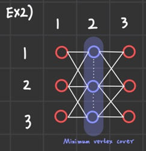

# 백준 1014번-컨닝(최대 유량)

## 문제

- 백준, 플래티넘 4, [문제 링크](https://www.acmicpc.net/problem/1014 "https://www.acmicpc.net/problem/1014")
- 풀이 날짜: 2025.05.16, 2025. 5. 29, 2025. 5. 30, 2025. 5. 31
- 풀이 시간:
  - 5.16: 14:37~16:09
  - 5.29: 13:30~14:55 쾨닉 정리 공부하기
  - 5.30: 17:04~18:22 최대 유량을 통한 풀이 방법 정리하기, 21:30~00:49 (왜 안되는지 모르겠다)
  - 5.31: 15:04~16:18(Out of bounds로 인해 테스트케이스 확인)
- 알고리즘 분류: 최대 유량
- 사용 언어: C++

## 문제 해설: Max Flow로 풀기 1차

[최대 유량 문제](https://gazelle-and-cs.tistory.com/60 "https://gazelle-and-cs.tistory.com/60"). 인데 모르겠다.

<br>

예제 반례

4 6

xx.x

xxxx

x.xx

….

xxxx

xx.x

<br>

예제 출력

5

<br>

1. 홀수 세로줄 모두 채우기
2. 모든 학생이 있는 자리마다, 자리를 비우고 이웃한 자리에 더 많은 학생을 앉힐 수 있다면 현재 자리를 비우고 학생을 앉힌다.
3. 모든 자리별로 더 변경할 수 없을 때까지 반복.

그런데 모든 학생을 검사해야 하다 보니, 한번 변경할 때마다 꽤 많은 비용이 들 것으로 예상되었다.

<br>

그런데 생각해보면 $100 \times 변경 횟수 \times \text{BFS로 연결된 노드 탐색하는 데에 필요한 비용}$ 정도의 비용이 들 것으로 예상되는데 아무리 많이 해봐야 문제 푸는 데에는 지장이 없지 않나는 생각이 든다.

일단 아이디어가 생각 안 나서 여기서 스탑.

### <br>

## 문제 해설: Max Flow로 풀기 2차 시도

### 최대 유량 문제 관점에서 문제 분석하기

해당 문제가 최대 유량 문제인 이유는 다음 글에 잘 정리되어 있다([https://jaeseo0519.tistory.com/126](https://jaeseo0519.tistory.com/126)). 크기가 커지면 할 수 없지만, 크기가 작을 땐 최대 유량을 통해 구할 수 있다는 특징이 있다.

문제에 선행되는 지식으로 [[쾨니그 정리]]가 있다.

<br>

우선, vertex cover의 정의를 보자.

> **vertex cover**
>
> ---
>
> 임의의 그래프 G = (V, E)에 대해서 부분집합 U ≤ V에 대해서, 모든 간선의 한 끝 점이 U에 속하면 U를 vertex cover라 한다.

쾨니그 정리의 글에 정리되어 있는 것을 보면, vertex cover를 최적화하는 문제가 바로 minimum vertex cover를 구하는 문제이다.

이를 이용하여 문제 해결을 접근해보자.

<br>

위와 같은 배치가 주어졌을 때, 가운데의 파랑 세 자리를 선택하면 이것이 minimum vertex cover가 된다.

이때 전체 자리에서 minimum vertex cover를 제외한다면, 총 좌석에서 사람이 최대로 앉을 수 있는 자리가 될 것이다.

부서진 자리가 있을 때도 가정해보자.

<br>

1번, 8번, 9번 좌석이 부서졌다고 할 때, 해당 자리와 간선을 연결하지 않으면 된다.

그렇게 되면, minimum vertex cover는 위 그림에서 파랑으로 표시된 2, 5번 vertex가 된다.

이 경우 최대한으로 사람을 앉힐 경우 선택 가능한 좌석은 3, 4, 6, 7번 좌석인데, 이는 (전체 자리 수) - (부서진 자리 수) - (minimum vertex cover)와 같다.

여기에서 별도로 구해야 할 것은 바로 minimum vertex cover의 수이다. 이를 간단하게 구할 방법이 있을까?

이때 [[쾨닉의 정리]]에 대한 내용이 필요하다. 쾨닉의 정리에 따르면, bipartite graph에서 minimum vertex cover의 수에는 제약이 존재한다.

> **쾨니그의 정리(Kőnig's theorem)**
>
> ---
>
> _모든 bipartite graph에서 maximum matching의 크기와 minimum vertex cover의 크기는 동일하다._

maximum matching의 크기보다 minimum vertex cover의 크기가 작아질 수는 없다. 특히, bipartite graph에서는 둘이 동일함을 증명할 수 있다.

그런데 이때, maximum matching은 bipartite graph에서의 maximum flow와 동일하다.

왜 그런지 살펴보자.

<br>

위와 같은 그래프의 bipartite graph에서 maximum matching을 구하고자 한다.

이때, v를 시작점 s(source)와 연결하고, u를 끝점 t(sink)에 연결하게 되면, flow network로 해석할 수 있다. 해당 상태가 바로 아래 그림의 (a)이다.

<br>

v와 u 사이에는 한계 값을 무한대(혹은 굉장히 큰 값)로 두도록 하자.

예시로 그림 (b)와 같은 flow network가 주어져 있을 때, s에서 t로 가는 증강 경로(augmented path)를 찾으면, s-2-4-1-3-t와 같은 경로가 된다. s-2, 2-4, 1-3, 3-t는 v→u로 가는 순방향 간선이므로 flow를 추가하고, 4-1은 v←u로 가는 역방향 간선이므로 flow를 감소시킨다. 이를 활용해 flow 값을 추가하면, (c)와 같은 상태가 된다.

그림 (c)에서는 더이상 증강 경로를 찾을 수 없다. 즉 최대 유량(maximum flow)이 흐르게 된다.

<br>

이때 잘 보면, s와 v, u와 t 사이의 간선에는 각각 최대 1의 유량만 흐를 수 있으므로, 각 정점에 흐를 수 있는 유량은 최대 1로 제한된다. 이러한 특징 덕분에 그림 (b), 그림 (c)에서 유량이 흐르는 빨강 간선은 각 정점마다 최대 하나만 존재할 수 있는데, 이러한 특성은 matching의 정의와 같다.

> **Matching**
>
> ---
>
> 임의의 그래프 G=(V,E)에 대해서, 부분집합 M⊆E의 모든 간선이 정점을 공유하지 않을 때, M을 matching이라고 부른다.

정의가 어렵게 느껴지는데, 쉽게 말하자면 모든 간선에서 같은 정점이 최대 한 번만 나타날 수 있다. 간선 A, B, C가 있을 때, 그 사이에서 정점 v는 세 간선 중 최대 한 간선에만 연결될 수 있다.

<br>

바로 위와 같은 경우가 matching이다.

다시 돌아와서, 그림 (b), 그림 (c)와 같은 flow network에서는 모든 간선은 같은 정점을 공유하지 않으므로, 유량이 흐르는 간선은 matching과 동일하다고 볼 수 있다.

<br>

특히 그림 (c)는 최대 유량이 흘러서 이러한 간선의 수가 최대가 된다. 즉 maximum matching이 나타나게 된다.

위와 같은 식으로 flow network를 구성하면, bipartite graph의 최대 유량을 통해 maximum matching을 구할 수 있게 된다.

### 문제 풀이하기

이제 flow network 관점에서 문제를 풀이해 보자.

flow network에서 maximum flow를 구하는 방법은 DFS를 사용하는 포드-풀커슨 방법(Ford-Fulkerson method)과 BFS를 사용하는 애드몬드-카프(Edmonds-Karp) 방법이 있다. 포드-풀커슨 방법은 최악의 경우 시간 복잡도가 O((V+E)F) (정점의 수는 V, 간선의 수는 E, 최대 flow는 F일 때)로 나타나고, 애드몬드-카프 방법은 시간 복잡도가 O(VE^2)로 나타나 일반적으로 애드몬드-카프 방법이 유리하다. 다만, 흘려보낼 flow가 적고 간선의 수가 많은 경우 포드-풀커슨 방법이 더 유리하다.

여기에서는 내가 배웠던 DFS 방식의 포드-풀커슨 방법을 활용하도록 하였다.

방법을 정리하면 이렇다.

1. 부서진 자리를 제외하고 모든 자리를 이웃한 자리와 간선으로 연결한다(대각선 및 좌, 우로 연결된 자리를 간선으로 연결).
   - source s와 v에 해당하는 정점, sink t와 u에 해당하는 정점은 최대 flow를 1로 설정한다.
   - v와 u 사이는 최대 flow를 무한히 크게 설정한다.
2. 포드-풀커슨 방법으로 최대 유량을 구한다(증강 경로가 나오지 않을 때까지 유량을 갱신).
3. (전체 자리) - (부서진 자리) - (최대 유량)을 출력한다.

이렇게 해서 풀면 이렇다.

```cpp
#include <iostream>
#include <cstring>
#include <vector>
#include <algorithm>

using namespace std;

inline bool isBroken(vector<pair<int, int>>& edge)
{
    return edge.size() == 0;
}

class FlowEdge
{
public:
    int v;
    int w;
    int flow;
    int maximumFlow;

    FlowEdge(int inV, int inW, int inMaximumFlow)
        : v(inV), w(inW), flow(0), maximumFlow(inMaximumFlow)
    {}

    void AddFlow(int flow, int startVertex)
    {
        if (forward(startVertex))
            this->flow += flow;
        else
            this->flow -= flow;
    }

    int remainedFlow(int startVertex) const
    {
        if (forward(startVertex))
            return maximumFlow - flow;
        else
            return flow;
    }

    inline bool forward(int vertex) const
    {
        return vertex == v;
    }

    inline int other(int vertex) const
    {
        if (vertex == v)
            return w;
        else
            return v;
    }
};

inline int vertex(int row, int col, int colSize)
{
    return row * colSize + col;
}

bool visited[102];
vector<FlowEdge*> edges[102];
int source;
int sink;

// ford-fulkerson 방식으로 augmented path를 찾는다(sink 발견시 중단)
bool TryFindAugmentedPath(int v, vector<FlowEdge*>& outPath, vector<int>& outVertex)
{
    if (v == sink)
        return true;

    // remained flow > 0인 주변 간선을 탐색한다.
    visited[v] = true;
    outVertex.push_back(v);

    for (FlowEdge* const e : edges[v])
    {
        if (!visited[e->other(v)] && e->remainedFlow(v) > 0)
        {
            outPath.push_back(e);
            if (TryFindAugmentedPath(e->other(v), outPath, outVertex))
                return true;
            outPath.pop_back();
        }
    }
    outVertex.pop_back();
    visited[v] = false;
    return false;
}

int main()
{
    int c;

    ios_base::sync_with_stdio(false);
    cin.tie(nullptr);

    string map[10];
    const int inf = 987654321;

    cin >> c;

    while (c--)
    {
        int n, m;

        cin >> n >> m;

        source = n*m;
        sink = n*m + 1;

        int brokenSeat = 0;
        string line;

        for (int i = 0; i <= n * m + 1; i++)
            edges[i].clear();

        for (int i = 0; i < n; i++)
        {
            cin >> map[i];
            for (int j = 0; j < m; j++)
            {
                if (map[i][j] == 'x')
                   brokenSeat++;
            }
        }

        for (int i = 0; i < n; i++)
        {
            // V
            for (int j = 0; j < m; j += 2)
            {
                if (map[i][j] == 'x')
                    continue;

                // source 연결
                int cur = vertex(i, j, m);
                FlowEdge* pe = new FlowEdge(source, cur, 1);
                edges[source].push_back(pe);

                // 다음 정점과 연결(순방향)
                if (j + 1 == m)
                    break;
                int start = max(i - 1, 0), end = min(i + 1, n - 1);
                for (int row = start; row <= end; row++)
                {
                    int next = vertex(row, j + 1, m);
                    pe = new FlowEdge(cur, next, inf);
                    edges[cur].push_back(pe);
                    edges[next].push_back(pe);
                }
            }
            // U
            for (int j = 1; j < m; j += 2)
            {
                if (map[i][j] == 'x')
                    continue;

                // sink에 연결
                int cur = vertex(i, j, m);
                FlowEdge* pe = new FlowEdge(cur, sink, 1);
                edges[cur].push_back(pe);
                edges[sink].push_back(pe);

                // 다음 정점과 연결(역방향)
                if (j + 1 == m)
                    break;
                int start = max(i - 1, 0), end = min(i + 1, n - 1);
                for (int row = start; row <= end; row++)
                {
                    int next = vertex(row, j + 1, m);
                    pe = new FlowEdge(next, cur, inf);
                    edges[cur].push_back(pe);
                    edges[next].push_back(pe);
                }
            }
        }

        // ford-fulkerson 방법으로 maximum flow 계산
        vector<FlowEdge*> augmentedEdges;
        vector<int> augmentedVertices;
        for (FlowEdge* const edge : edges[source])
        {
            memset(visited, 0, sizeof(visited));
            augmentedEdges.clear();
            augmentedVertices.clear();
            if (edge->flow == 0 && TryFindAugmentedPath(edge->w, augmentedEdges, augmentedVertices))
            {
                edge->AddFlow(1, source);
                for (int i = 0; i < augmentedEdges.size(); i++)
                {
                    augmentedEdges[i]->AddFlow(1, augmentedVertices[i]);
                }
            }
        }

        // maximum matching(maximum flow)을 구한다.
        int maximumMatching = 0;
        for (const FlowEdge* edge : edges[sink])
        {
            maximumMatching += edge->flow;
        }

        // ptr 해제
        // u->v 해제
        for (FlowEdge* sourceEdge : edges[source])
        {
            for (FlowEdge* edge : edges[sourceEdge->w])
            {
                delete edge;
            }
        }
        // source 해제
        for (FlowEdge* edge : edges[source])
        {
            delete edge;
        }
        // sink 해제
        for (FlowEdge* edge : edges[sink])
        {
            delete edge;
        }

        // 앉을 수 있는 자리 = (전체 자리) - (부서진 자리) - (maximum matching)
        int result = n * m - brokenSeat - maximumMatching;
        cout << result << "\n";
    }

    return 0;
}
```

Edge를 만들도록 하려다 보니 한 Edge를 여러 노드가 공유하게 해야 했고, 고민하다가 Edge를 만들 방법으로 포인터를 선택하게 되었다.

그로 인해 굉장히 문제를 빙빙 돌아가게 되었다. 특히, 객체를 삭제할 때 어떻게 한 번에 삭제할 수 있을지에 대한 고민이 그에 해당했다.

<br>

이때 한 가지 꿀팁을 배울 수 있었는데, 컨테이너를 배열이든 어디든 생성해놓았다면 이는 바로 바로 초기화하는 것이 좋다. 실제로, vector<FlowEdge\*> edges\[102\]를 바로 초기화하지 않았다가, 이해할 수 없는 동작으로 인해 Out of Bounds 오류에 빠지는 일이 생겼다.

<br>

당연하지만 동적 할당으로 인해 속도가 굉장히 저하되었는데, 풀이에 540 ms가 소요된다. 이는 평균적인 풀이 속도와는 엄청난 차이가 난다.  
<br>

그렇다면 다른 풀이에서는 어떻게 접근할까?

[이분의 글](https://jaeseo0519.tistory.com/126 "https://jaeseo0519.tistory.com/126")을 보고 참고해 보았다.

이를 최적화하는 방법은 이분 그래프라는 특징을 살리는 것으로, ‘A, B로 집합을 나누어, A에서만 B에 접근하자’는 것이다.

홀수 열은 source 점과 연결되므로 A 집합으로, 짝수 열은 sink 점에 연결되므로 B 집합으로 본다.

이때, 이분 그래프는 ‘역간선을 고려할 이유가 없다’는 점을 이용한다. 만약 A0가 이미 선점하고 있는 점이어서 A1이 차지하지 못한다면, A0가 차지할 수 있는 다른 자리를 찾아서 (만약 자리가 있다면) A0가 양보해주면 된다.

이렇게 구현하면 Ford-Fulkerson 특유의 비효율성도 사라지고, 구현도 단순해진다.

방향이 이미 정해져 있으므로

`vector<tii> vc = {{-1,-1}, {0,-1}, {1,-1}, {-1,1}, {0,1}, {1,1}};` 와 같이 방향을 지정하는 벡터를 만드는 것도 좋은 방법으로 보인다.

이를 반영하면 다음과 같이 해결 가능하다(다만, 다른 코드와 비슷함).

```cpp
#include <iostream>
#include <vector>
#include <cstring>

using namespace std;

vector<pair<int, int>> dirs = {{ -1, -1 }, { 0, -1 }, { 1, -1 }, { -1, 1 }, { 0, 1 }, { 1, 1 }};
int aMatch[50], bMatch[50];
bool visit[50];

bool findMatch(int id, vector<int> adj[50])
{
    visit[id] = true;
    for (int b : adj[id])
    {
        if (bMatch[b] == -1 ||
            (!visit[bMatch[b]] && findMatch(bMatch[b], adj)))
        {
            aMatch[id] = b;
            bMatch[b] = id;
            return true;
        }
    }
    return false;
}

int main()
{
    ios_base::sync_with_stdio(false);
    cin.tie(0);
    cout.tie(0);

    int c;

    cin >> c;

    while (c--)
    {
        int n, m;
        cin >> n >> m;

        string map[10];
        for (int i = 0; i < n; i++)
            cin >> map[i];

        vector<int> adj[50];
        int id[10][10];

        // 정점별로 번호를 매긴다.
        int a, b;
        a = b = 0;
        int broken = 0;
        for (int i = 0; i < n; i++)
        {
            for (int j = 0; j < m; j++)
            {
                if (map[i][j] == 'x')
                {
                    id[i][j] = -1;
                    broken++;
                }
                else
                    id[i][j] = j % 2 == 0 ? a++ : b++;
            }
        }

        for (int i = 0; i < n; i++)
        {
            // 홀수열에 대해 A 집합으로 묶는다.
            for (int j = 0; j < m; j += 2)
            {
                if (map[i][j] == 'x')
                    continue;

                for (pair<int, int> dir : dirs)
                {
                    int ny = i+dir.first, nx = j+dir.second;
                    if (ny < 0 || ny >= n || nx < 0 || nx >= m ||
                        id[ny][nx] == -1)
                        continue;
                    adj[id[i][j]].push_back(id[ny][nx]);
                }
            }
        }

        int match = 0;
        memset(aMatch, -1, sizeof(aMatch));
        memset(bMatch, -1, sizeof(bMatch));
        for (int i = 0; i < a; i++)
        {
            memset(visit, 0, sizeof(visit));
            if (findMatch(i, adj))
            {
                match++;
            }
        }
        cout << n * m - broken - match << "\n";
    }

    return 0;
}
```

다음에는 다이나믹 프로그래밍을 이용해서 풀어보자.
